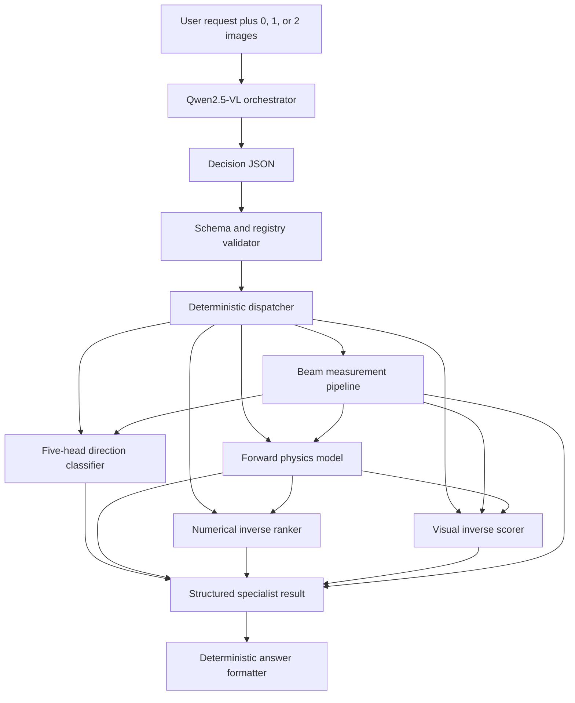

# Current state of the Qwen-orchestrated optical-control system

Snapshot date: **2026-07-27**  
Workspace: `/home/jiamo/VLM`  
Purpose: self-contained technical handoff for a new reviewer who has no access
to the preceding development conversation.

## 1. Executive summary

This project is a simulation-domain optical-control system with two layers:

1. **Qwen orchestrator**: reads a natural-language request and zero, one, or
   two images; identifies the requested task; extracts and normalizes the
   visible arguments; binds image roles; and returns a validated registered
   route.
2. **Specialists**: perform beam-image measurement, qualitative direction
   prediction, numerical forward prediction, or inverse action selection.

The current Qwen model is based on **Qwen2.5-VL-3B-Instruct** with a rank-8
QLoRA adapter. It is a multimodal orchestrator, not the numerical physics
model. Qwen can inspect images for routing and image-role binding, but
specialist image metrology converts beam images into numerical beam states.

The current candidate supports four task types through seven fixed routes:

- beam-profile measurement from one image;
- direction prediction from a numerical state;
- direction prediction from an image;
- forward numerical prediction from a numerical state;
- forward numerical prediction from an image;
- inverse action selection from two numerical states;
- inverse action selection from current and desired images.

The current candidate is **not a production model**:

- Qwen checkpoint 1000 was the strongest full-validation candidate but did
  not pass every frozen orchestration gate.
- No Qwen checkpoint is formally promoted.
- The three sealed Qwen test sets, containing 3,800 records, remain unopened.
- The newest direction model is enabled only through a hash-pinned validation
  overlay, not the default manifest.
- The current data and results are simulation-only. No laboratory accuracy is
  claimed.
- Most specialist rebuilds were trained once with one seed for fast
  verification, not with multiple seeds and full server-scale datasets.

The latest important result is the direction rebuild:

- previous end-to-end direction all-five accuracy:
  **37/300 = 12.33%**;
- current end-to-end direction all-five accuracy:
  **156/300 = 52.00%**;
- Qwen routing causes zero measured loss for direction on this validation set.

The present performance bottleneck is the specialist layer, particularly the
forward model:

| Physical task metric | End-to-end system | Correct-route specialist |
|---|---:|---:|
| Beam measurement, all five values correct | 115/150 = **76.67%** | 76.67% |
| Direction, all five labels correct | 156/300 = **52.00%** | 52.00% |
| Forward, all five changes within tolerance | 80/300 = **26.67%** | 82/300 = **27.33%** |
| Inverse, physical target reached | 147/300 = **49.00%** | 151/300 = **50.33%** |

These rows use different task-specific definitions and should not be averaged
as if they were one common accuracy.

## 2. What Qwen does and does not do

### 2.1 Qwen's responsibility

Qwen maps:

```text
natural-language request + optional images
-> orchestration decision JSON
```

The decision contains:

```text
status
task_type
route_name
canonical numerical arguments
image-role bindings
missing fields
clarification question, when applicable
```

The three orchestration statuses are:

- `ready`: the request contains enough information for one registered route;
- `needs_clarification`: required information is missing or conflicting;
- `unsupported`: the request falls outside the frozen capability set.

Qwen proposes only a symbolic route name. It cannot supply a Python module,
arbitrary executable, filesystem path, or unregistered tool.

### 2.2 Deterministic controls after Qwen

Every Qwen decision passes through:

1. JSON-schema validation;
2. registered-route validation;
3. argument-group validation;
4. finite-number and unit-path validation;
5. image availability and image-role validation;
6. deterministic dispatch to the backend fixed for that route.

An invalid decision is rejected rather than executed. The safe normalizer can
canonicalize non-executing `needs_clarification` and `unsupported` outputs. It
cannot modify an executable `ready` decision.

### 2.3 What Qwen does not predict

Qwen does not directly predict:

- beam centroid, width, or peak intensity;
- the numerical effect of an actuator movement;
- the five direction labels;
- the inverse-control action;
- simulator states or private candidate tables.

Those outputs come from the specialists. Current final responses are
deterministically formatted from the structured specialist result. A separate
natural-language response-generation stage has not been trained.

## 3. End-to-end runtime dataflow



No deployed inference path calls the optical simulator. Simulator calls are
allowed only while constructing datasets and while privately scoring
evaluation outputs.

## 4. Fixed numerical contract

### 4.1 Optical setup

The visible optical setup contains 12 numerical fields:

| Field | Meaning | Unit |
|---|---|---|
| `wavelength_nm` | source wavelength | nm |
| `beam_waist_mm` | input beam waist | mm |
| `power_w` | optical power | W |
| `lens_focal_length_mm` | lens focal length | mm |
| `lens_aperture_mm` | lens aperture | mm |
| `source_to_lens_mm` | source-to-lens distance | mm |
| `lens_to_camera_mm` | lens-to-camera distance | mm |
| `lens_x_offset_mm` | lens horizontal offset | mm |
| `lens_y_offset_mm` | lens vertical offset | mm |
| `camera_x_offset_mm` | camera horizontal offset | mm |
| `camera_y_offset_mm` | camera vertical offset | mm |
| `pixel_size_um` | sensor pixel size | µm |

### 4.2 Beam state

Every beam state contains five values:

| Field | Meaning |
|---|---|
| `centroid_x_px` | horizontal beam centroid in pixels |
| `centroid_y_px` | vertical beam centroid in pixels |
| `sigma_x_px` | horizontal Gaussian width in pixels |
| `sigma_y_px` | vertical Gaussian width in pixels |
| `peak_intensity` | peak image intensity |

The image measurement route reports sensor-frame centroids. Control routes
convert the measured sensor frame into the legacy/base control frame before
calling numerical specialists.

### 4.3 Action

Every action contains four values:

| Field | Allowed values |
|---|---|
| `lens_x_delta_mm` | `-0.05`, `0`, `+0.05` |
| `lens_y_delta_mm` | `-0.05`, `0`, `+0.05` |
| `camera_x_delta_mm` | `-0.02`, `0`, `+0.02` |
| `camera_y_delta_mm` | `-0.02`, `0`, `+0.02` |

The Cartesian product contains exactly:

```text
3 × 3 × 3 × 3 = 81 actions
```

The inverse controller cannot select an action outside this grid.

### 4.4 Direction labels

The direction specialist produces one of:

```text
decrease
no_change
increase
```

for each of:

```text
centroid_x
centroid_y
width_x
width_y
peak_intensity
```

Let `change` be next state minus current state. Direction thresholds are:

- centroid X/Y: 1 pixel;
- width X/Y: 2 pixels;
- peak intensity: 5% of the current peak.

For each field:

```text
normalized_change = change / threshold

normalized_change < -1  -> decrease
-1 <= normalized_change <= 1 -> no_change
normalized_change > 1   -> increase
```

### 4.5 Task success tolerances

The strict metrics used in this project are:

**Forward prediction**

- centroid-change error no greater than 1 pixel on each axis;
- width-change error no greater than 2 pixels on each axis;
- peak-change error no greater than 5% of the current peak;
- all five conditions must pass in the same request.

**Beam measurement**

- centroid error no greater than 1 pixel on each axis;
- width error no greater than 2 pixels on each axis;
- peak error no greater than 5%;
- all five conditions must pass in the same image.

**Inverse target reached**

- centroid-vector distance no greater than 0.5 pixels;
- each width error no greater than 1 pixel;
- peak relative error no greater than 2%.

An inverse request is:

- `unique` if one action is the accepted minimum-movement match;
- `ambiguous` if more than one action matches;
- `infeasible_within_limits` if no action in the 81-action grid matches.

## 5. The seven registered routes

| Route | Required input | Current candidate backend |
|---|---|---|
| `measure_beam_profile_v1` | one beam image and calibration | guarded measurement v4 |
| `predict_direction_from_state_v1` | setup, current state, action | balanced direction tree v4 |
| `predict_direction_from_image_v1` | setup, current image, calibration, action | measurement then direction tree v4 |
| `predict_forward_from_state_v1` | setup, current state, action | forward v4 |
| `predict_forward_from_image_v1` | setup, current image, calibration, action | measurement then forward v4 |
| `select_inverse_action_from_states_v1` | setup, current state, desired state | forward v4 over 81 actions, then inverse v4 |
| `select_inverse_action_from_images_v1` | setup, current image, desired image, calibration | two measurements, forward v4, inverse v4, visual scorer v4 |

The current route contract smoke test passed **7/7 routes** and recorded zero
simulator calls at inference.

The selected tree direction model itself does not consume forward-model
predictions. `forward_v4` remains listed in the direction overlay route
artifacts because the shared runtime loads the forward backend and also
supports a previously tested fused direction artifact.

## 6. Qwen orchestration dataset

Dataset version: `qwen_orchestration_sft_v1`  
Seed: `20260724`  
Dataset root: `/home/jiamo/VLM_data/qwen_orchestration/v1`  
Declared domain: **simulation-only**

### 6.1 Record and physical-group counts

| Split | Records | Physical groups | Current use |
|---|---:|---:|---|
| Training | 10,000 | 1,000 | QLoRA training |
| In-domain validation | 1,600 | 200 | checkpoint selection and system evaluation |
| IID sealed test | 1,600 | 200 | not opened |
| OOD-language sealed test | 1,000 | 200 | not opened |
| Visual-stress sealed test | 1,200 | 300 | not opened |
| **Total** | **15,400** | **1,900** | |

Audit results:

- 15,400 unique prompt strings;
- 3,460 unique image hashes;
- 2,000 distinct training visual paths;
- 1,000 distinct training current/desired image pairs;
- zero physical-group overlap between splits;
- zero image-hash overlap between physical splits;
- all 15,400 records passed dataset audit.

### 6.2 Training distribution

The 10,000 training rows contain:

- 1,000 rows for each of seven executable routes: 7,000;
- 2,000 clarification rows;
- 1,000 unsupported rows.

Every executable route uses five prompt families:

- direct;
- conversational;
- terse;
- reordered;
- distractor-bearing.

Visual training conditions are:

- 2,000 clean visual records;
- 600 noise records;
- 400 blur records;
- 400 dim-plus-noise records;
- 400 saturation records;
- 200 crop/boundary records.

These are prompt-record counts. Images can be reused only within the same
physical split.

### 6.3 Validation distribution

The 1,600 in-domain validation records contain:

- 150 records for each of seven executable routes: 1,050 ready requests;
- 350 clarification requests;
- 200 unsupported requests;
- 600 ready requests containing images;
- 2,700 required argument groups;
- 19,200 numerical values with field paths that specify units.

All validation images are clean simulation images. Visual corruption is
reserved for the sealed visual-stress set and separate measurement-specialist
validation.

## 7. Qwen model and training

### 7.1 Base and adapter

Base model:

```text
/home/jiamo/HF_models/Qwen2.5-VL-3B-Instruct
```

Training starts from the previously frozen visual tool-orchestration adapter:

```text
/home/jiamo/VLM_runs/qwen25vl_3b_qlora_visual_tool_orchestration_v10_2_seed49
```

Configuration:

- base model loaded in 4-bit NF4;
- bfloat16 calculation;
- rank-8 LoRA;
- LoRA alpha 16;
- LoRA dropout 0.05;
- language and visual LoRA tensors are trainable;
- base model weights remain frozen;
- expected adapter scope: 504 language LoRA tensors and 192 visual tensors;
- completion-only cross-entropy;
- image/token packing disabled;
- deterministic generation with temperature 0.

### 7.2 Two training stages

**Stage 1: route and status**

- training rows: 10,000;
- one epoch;
- micro-batch 1;
- gradient accumulation 8;
- effective batch 8;
- 1,250 optimizer steps;
- learning rate `1e-5`;
- warm-up 100 steps.

Stage-1 targets contain only status, task type, and route.

**Stage 2: complete canonical call**

- training rows: the same 10,000;
- one epoch;
- micro-batch 1;
- gradient accumulation 4;
- effective batch 4;
- 2,500 optimizer steps in the original full schedule;
- learning rate `5e-6`;
- warm-up 125 steps.

Stage-2 targets contain the complete decision JSON, including arguments,
image roles, missing fields, and the clarification question.

The saved candidate used by the current system evaluation is:

```text
/home/jiamo/VLM_runs/qwen_orchestrator_v1_stage2_schema_refinement_v2_seed20260724/checkpoint-1000
```

Its deterministic saved predictions are:

```text
/home/jiamo/VLM/Qwen_orchestration/results/v1/stage2_safe_runtime_v1/checkpoint-1000_all.jsonl
```

## 8. Qwen full-validation results

These metrics test Qwen's orchestration decision, not physical specialist
accuracy.

| Metric | Frozen minimum | Checkpoint 1000 |
|---|---:|---:|
| JSON-schema-valid decisions | 99.00% | **1,581/1,600 = 98.8125%** |
| Registry-valid ready calls | 99.00% | **1,035/1,050 = 98.5714%** |
| Correct route on ready requests | 95.00% | **1,037/1,050 = 98.7619%** |
| Exact required argument groups | 97.00% | **2,650/2,700 = 98.1481%** |
| Exact numerical value and unit path | 95.00% | **18,874/19,200 = 98.3021%** |
| Exact image-role binding | 98.00% | **587/600 = 97.8333%** |
| Correct clarification status | 95.00% | **346/350 = 98.8571%** |
| Correct unsupported status | 95.00% | **200/200 = 100.00%** |
| Unsupported request incorrectly marked ready | at most 1.00% | **0/200** |

Formal promotion failed because:

- schema validity was 3 records below the required 1,584;
- registry-valid ready calls were 5 below the required 1,040;
- image-role accuracy was 1 below the required 588.

The formal selection file therefore contains:

```text
selected_checkpoint: null
```

Checkpoint 1000 is used only as the strongest evaluation candidate.

### 8.1 Where Qwen errors concentrate

Direction routing was exact for all 300 direction-validation requests.
Measurement and numerical inverse-from-state routing were also exact on their
150-route subsets.

The most visible route failures were:

- invented forward-route aliases such as
  `predict_forward_changes_from_state_v1`;
- one invented image-forward alias;
- malformed two-image inverse decisions;
- wrong image-role keys such as `current` and `desired` instead of the
  registered role names;
- unexpected JSON fields or missing required schema fields;
- one action outside the exact registered 81-action grid.

The current full system executed **1,034/1,050 = 98.4762%** of ready requests.
Invalid decisions were rejected; they were not silently executed.

### 8.2 Clarification-content limitation

Qwen correctly selected clarification for 346/350 validation requests, but a
stricter non-gating comparison with the single canonical target found:

- exact missing-field list: 11/350;
- exact clarification-question wording: 0/350;
- both exact: 0/350.

Many paraphrased questions may still be useful, but clarification content is
not reliably canonical.

### 8.3 Valid conclusion about Qwen

Within the generated in-domain validation distribution, Qwen has strong
ability to:

- recognize the requested task;
- select the correct registered route;
- copy and normalize numerical arguments;
- distinguish ready, clarification, and unsupported requests;
- bind image roles.

It is not yet valid to claim equivalent performance for:

- unseen OOD-language constructions;
- corrupt/stress images;
- real laboratory images;
- optical tasks outside the seven-route registry.

## 9. Numerical specialist datasets

The specialist numerical data are separate from the 10,000 Qwen orchestration
records.

### 9.1 Existing-distribution numerical data

Root:

```text
/home/jiamo/VLM_data/specialist_rebuild_v2
```

Counts:

- training: 2,500 independent setup groups × 81 actions =
  **202,500 transitions**;
- validation: 300 groups × 81 actions =
  **24,300 transitions**.

### 9.2 New difficult quick-verification data

Root:

```text
/home/jiamo/VLM_data/control_rebuild_v4_quickcheck
```

Counts:

- training: 2,000 groups × 81 actions = **162,000 transitions**;
- validation: 300 groups × 81 actions = **24,300 transitions**.

The 300 difficult validation groups contain:

- 52 expanded in-distribution groups;
- 128 boundary groups;
- 120 high-nonlinearity groups.

Training and validation setup groups are disjoint. These are validation sets,
not sealed tests.

### 9.3 Effective number of independent examples

The combined numerical training set contains:

```text
364,500 transitions
```

but only:

```text
4,500 independently sampled optical setups
```

The 81 transitions inside one group share the same setup and current beam
state. They are correlated action variants, not 81 independent physical
contexts.

## 10. Beam-image measurement specialist

### 10.1 Structure

The measurement pipeline contains:

1. a v3 spatial analytic-plus-neural image model;
2. a small v4 residual calibrator;
3. a guarded analytic-moments fallback.

The v3 model consumes five 2D channels:

- observed image;
- linearized image;
- valid-pixel mask;
- normalized X coordinate;
- normalized Y coordinate.

It uses five convolutional blocks:

```text
5 -> 16 -> 24 -> 32 -> 48 -> 64 channels
```

with stride-2 convolution, GroupNorm, and SiLU. The spatial representation is
pooled to 4 × 4. Two additional MLP branches encode:

- 11 calibration values;
- 9 analytic-moment features.

The concatenated head is:

```text
1152 -> 256 -> 128 -> 5 outputs
```

Parameter count: **393,597**.

The v4 calibrator is:

```text
31 inputs -> 160 -> 160 -> 96 -> 5 normalized corrections
```

Parameter count: **47,141**.

The calibrator was trained on 70,000 transformed views and validated on 8,400
views.

### 10.2 Controlled all-condition validation

The v4 measurement pipeline achieved:

```text
5,734/8,400 = 68.26% strict all-five success
```

by condition:

| Condition | Strict all-five success |
|---|---:|
| Clean | 1,138/1,200 = **94.83%** |
| Blur | 1,125/1,200 = **93.75%** |
| Crop/boundary | 1,138/1,200 = **94.83%** |
| Gamma shift | 1,151/1,200 = **95.92%** |
| Dim plus noise | 328/1,200 = **27.33%** |
| Noise | 333/1,200 = **27.75%** |
| Saturation | 521/1,200 = **43.42%** |

The main measurement weaknesses are noise, dim-plus-noise, and saturation.

### 10.3 Measurement in the final Qwen system

Under the public four-field image-calibration contract on 150 clean Qwen
validation images:

```text
115/150 = 76.67% strict all-five success
```

All 150 direct measurements used:

```text
calibrated_analytic_moments
```

The guard selected the analytic backend rather than the learned CNN for this
public-contract validation. Therefore the 76.67% system result and the 68.26%
all-condition learned-pipeline result measure different paths and
distributions.

## 11. Direction specialist

### 11.1 Current selected structure

The selected direction model is a five-head tree ensemble:

```text
46 engineered numerical features
-> five independent HistGradientBoostingClassifier heads
-> three class probabilities per head
```

The 46 features contain:

- 12 setup values;
- 5 current-state values;
- 4 action values;
- 25 derived physical/action interaction features.

Each head predicts:

```text
decrease, no_change, or increase
```

Hyperparameters per head:

- 240 boosting iterations;
- maximum 63 leaf nodes;
- minimum 40 samples per leaf;
- learning rate 0.08;
- L2 regularization 0.10.

There are five heads and 1,200 total boosting iterations.

### 11.2 Class and threshold-distance balancing

For each field, training examples are stratified by:

1. direction class;
2. distance from the nearest threshold:
   `abs(abs(normalized_change) - 1)`;
3. near, middle, or far threshold-distance bin.

Distance bins are:

- near: no greater than 0.25;
- middle: greater than 0.25 and no greater than 0.75;
- far: greater than 0.75.

Inverse-square-root stratum weights are computed for all:

```text
5 fields × 3 classes × 3 distance bins = 45 strata
```

The selected run mixes 20% stratum-balanced weight with 80% uniform weight.

Training:

- seed `20260727`;
- 4,500 groups;
- 364,500 transitions;
- one seed;
- 3 minutes 28 seconds;
- approximately 0.88 GB peak RAM;
- zero swap;
- held-out tests opened: zero.

### 11.3 Direct direction validation

| Model | Existing-distribution all-five exact | Difficult all-five exact |
|---|---:|---:|
| Frozen v1 direction model | 2,970/24,300 = **12.22%** | 2,666/24,300 = **10.97%** |
| Thresholded forward v4 | 8,089/24,300 = **33.29%** | 7,116/24,300 = **29.28%** |
| New direction tree v4 | 12,609/24,300 = **51.89%** | 10,404/24,300 = **42.81%** |

New direction-tree per-field difficult-validation results:

| Field | Accuracy | Macro-F1 |
|---|---:|---:|
| Centroid X | 79.74% | 78.28% |
| Centroid Y | 80.13% | 78.68% |
| Width X | 92.81% | 89.04% |
| Width Y | 92.62% | 88.43% |
| Peak intensity | 71.04% | 70.56% |

Near the direction thresholds, difficult-validation accuracy remains lower:

- centroid X: 52.73%;
- centroid Y: 53.10%;
- peak intensity: 50.36%;
- width X: 60.08%;
- width Y: 66.88%.

The predeclared direction acceptance suite passed 3/6 gates. The model passed
both required joint improvements over v1 and the difficult macro-F1 gate. It
did not reach the aggressive 60% all-five exact threshold on either validation
split, and existing-distribution macro-F1 was 77.91% versus an 80% target.

### 11.4 Direction in the final Qwen system

Overall:

```text
156/300 = 52.00% all five directions correct
physical macro-F1 = 72.26%
correct-route specialist all-five exact = 52.00%
```

By route:

| Route | All-five exact | Macro-F1 |
|---|---:|---:|
| State input | 78/150 = **52.00%** | 71.58% |
| Image input | 78/150 = **52.00%** | 72.88% |

Per output across all 300 system records:

| Output | Correct | Accuracy | Macro-F1 |
|---|---:|---:|---:|
| Centroid X | 247/300 | 82.33% | 82.44% |
| Centroid Y | 250/300 | 83.33% | 82.66% |
| Width X | 275/300 | 91.67% | 55.71% |
| Width Y | 276/300 | 92.00% | 58.84% |
| Peak intensity | 244/300 | 81.33% | 81.65% |

Width accuracy is high while width macro-F1 is lower because the 300-record
system set contains relatively few non-`no_change` width examples.

## 12. Forward specialist

### 12.1 Structure

The forward model predicts all five normalized beam changes for all 81
actions. One normalized unit equals one field-specific tolerance.

It combines:

1. a global Ridge linear baseline;
2. a neural residual model.

The neural model is:

```text
46 inputs
-> Linear 384
-> LayerNorm + SiLU
-> three width-384 residual blocks
-> LayerNorm + SiLU
-> Linear 192 + SiLU
-> 5 outputs
```

Parameter count: **983,813**.

The output for the zero action is forced to exactly zero by subtracting the
same network's zero-action output. This anchors one physical constraint but
does not constrain the other 80 actions.

Training:

- seed `20260726`;
- 4,500 unique setup groups;
- 364,500 transitions;
- 36 epochs;
- best epoch 22;
- residual scale 1.0;
- loss =
  smooth-L1 mean error
  + 0.20 × mean worst-field error
  + 0.10 × inverse-retrieval ranking loss;
- training time approximately 106 seconds;
- held-out test used: false.

### 12.2 Direct forward validation

| Split | All five changes within tolerance | Mean absolute error in tolerance units |
|---|---:|---:|
| Training diagnostic | 169,797/364,500 = **46.58%** | 0.551 |
| Existing-distribution validation | 8,106/24,300 = **33.36%** | 0.685 |
| Difficult validation | 6,579/24,300 = **27.07%** | 0.818 |

On difficult validation:

| Output | Within tolerance |
|---|---:|
| Centroid X | 66.44% |
| Centroid Y | 66.64% |
| Width X | 94.36% |
| Width Y | 94.25% |
| Peak intensity | 53.07% |

The average largest error among the five fields is **2.19 tolerance units**.
The permitted maximum is 1.0 for strict success.

### 12.3 Failure as action complexity increases

An additional diagnostic grouped the difficult-validation actions by how many
of the four actuator components were nonzero:

| Nonzero action components | Transitions | All-five success |
|---:|---:|---:|
| 0 | 300 | **100.00%** |
| 1 | 2,400 | **58.46%** |
| 2 | 7,200 | **33.68%** |
| 3 | 9,600 | **19.19%** |
| 4 | 4,800 | **12.69%** |

For four-component actions, average errors in tolerance units were:

- centroid X: 1.233;
- centroid Y: 1.171;
- width X: 0.444;
- width Y: 0.433;
- peak intensity: 1.992.

This is direct evidence that the current model does not capture simultaneous
actuator interactions adequately.

### 12.4 Forward in the final Qwen system

```text
end-to-end physical all-five success: 80/300 = 26.67%
correct-route specialist:              82/300 = 27.33%
```

By route:

| Route | End-to-end physical success |
|---|---:|
| Numerical current state | 41/150 = **27.33%** |
| Current image | 39/150 = **26.00%** |

Qwen accounts for only 2 additional failures relative to correct-route
specialist execution. The main limitation is the forward specialist.

### 12.5 Why forward remains weak

The evidence supports all of the following:

1. **The task is much stricter than direction classification.** Direction
   requires only one of three coarse labels. Forward must produce five
   continuous changes simultaneously inside narrow tolerances.
2. **Peak and centroid are weak.** Width predictions already pass around
   94–95%, but peak passes only 53% and centroids about 66%.
3. **Multi-actuator interaction is not modeled well.** Success falls from
   58.46% for one changed component to 12.69% for four.
4. **The effective setup count is only 4,500.** The 364,500 transitions do not
   represent 364,500 independent optical contexts.
5. **There is both underfitting and a generalization gap.** Training strict
   success is only 46.58%, and difficult validation falls to 27.07%.
6. **The loss is not identical to the final metric.** It minimizes average
   regression and ranking errors rather than directly maximizing the event
   that every one of five errors is no greater than one tolerance.
7. **The architecture has limited physical structure.** It does not enforce
   X/Y symmetry, separate centroid/width/intensity mechanisms, or explicit
   higher-order interactions among lens and camera movements.

The numerical forward labels are deterministic simulator outputs, so random
label noise is not the main cause.

## 13. Numerical inverse specialist

### 13.1 Runtime dataflow

For each request:

1. forward v4 predicts the candidate next state for every one of 81 actions;
2. a deterministic normalized physical cost is calculated against the desired
   state;
3. the inverse network adds a learned correction to each candidate score;
4. the highest-scoring action is selected, with minimum movement as a
   deterministic tie-break;
5. a separate head predicts `unique`, `ambiguous`, or
   `infeasible_within_limits`.

### 13.2 Structure

Inputs:

- context dimension: 31;
- candidate dimension: 23 for each of 81 actions;
- status-feature dimension: 12.

Network:

```text
context: 31 -> 256 -> two residual blocks -> 160
candidate: 23 -> 128 -> 96
score correction: concatenated 256 -> 128 -> 1 per candidate
status head: 160 + 12 -> 128 -> 3
```

Parameter count: **385,284**.

Training:

- seed `20260726`;
- initialized from inverse v3;
- 72,000 unique pairs;
- 60,000 v2 pairs;
- 12,000 new v4-derived pairs;
- 35,761 measurement-augmented pairs;
- 20 requested epochs;
- best epoch 6;
- correction scale 1.0;
- training time approximately 47 seconds.

The rank loss pushes at least one physically matching action above
non-matching actions. A weighted cross-entropy term trains the three-class
status head.

### 13.3 Direct inverse validation

| Validation condition | Reachable targets reached |
|---|---:|
| Existing-distribution clean numerical states | 217/600 = **36.17%** |
| Existing-distribution measurement-augmented states | 126/600 = **21.00%** |
| Difficult clean numerical states | 622/1,200 = **51.83%** |
| Difficult paired measurement errors | 468/1,200 = **39.00%** |

Difficult-set status accuracy:

- clean: 1,400/1,800 = 77.78%;
- paired measurement errors: 1,290/1,800 = 71.67%.

For the difficult set:

- the true candidate oracle reaches 100% of requests declared reachable;
- forward-only retrieval reaches 488/1,200 = 40.67%;
- the learned inverse reaches 622/1,200 = 51.83%.

The inverse ranker improves candidate selection over forward cost alone, but
its candidate states still come from the weak forward model. Forward error is
therefore a direct upstream limitation.

## 14. Visual inverse specialist

### 14.1 Runtime dataflow

```text
current image + desired image
-> guarded measurement of both images
-> sensor-to-control coordinate conversion
-> forward v4 predicts 81 candidate states
-> numerical inverse v4 scores candidates
-> visual sensor residual scorer adjusts ranking
-> selected action + predicted status
```

The visual scorer uses the same inverse-ranker architecture:

- context 31;
- candidate 23;
- status features 12;
- parameter count 385,284.

It is initialized from numerical inverse v4 and trained as a separate
sensor-error-aware scorer.

Training:

- 2,500 training groups;
- 52,500 training pairs;
- 300 validation groups;
- 6,300 validation pairs across seven image conditions;
- best epoch 1 of 16;
- correction scale 1.0;
- training time approximately 34 seconds.

### 14.2 Controlled visual inverse validation

There are 4,200 reachable requests among 6,300 total requests.

```text
physical target reached for reachable requests:
1,813/4,200 = 43.17%
```

Additional metrics:

- all-request target success: 1,813/6,300 = 28.78%;
- status accuracy: 91.56%;
- minimum-movement exact among reachable requests: 42.17%;
- with oracle measurements, reachable target success: 61.00%.

The gap from 61.00% with oracle measurements to 43.17% with model measurements
shows that image measurement error causes a large part of visual inverse
failure. Forward and inverse-ranking errors remain after perfect measurement.

The predeclared visual-inverse floor was 44%. The selected candidate reached
43.17%, missing the gate by 0.83 percentage points.

## 15. Closed-loop control

A small 50-request validation evaluated repeated numerical control:

| Metric | Result |
|---|---:|
| Target reached after one step | **48.00%** |
| Target reached within three steps | **66.00%** |

Repeated feedback improves over a single action, but the sample is small and
simulation-only.

## 16. Current full-system evaluation

Authoritative current report:

```text
/home/jiamo/VLM_runs/direction_rebuild_v4_tree_one_seed/orchestrated_system_validation_per_field.json
```

Scope:

- all 1,600 frozen in-domain Qwen validation prompts;
- saved deterministic checkpoint-1000 Qwen decisions;
- current v4 specialist overlay with direction tree v4;
- 1,050 ready requests;
- CUDA specialist execution;
- evaluation duration approximately 122 seconds.

### 16.1 Physical task results

| Task | Count | End-to-end physical result | Correct-route specialist | Qwen-related loss |
|---|---:|---:|---:|---:|
| Measurement | 150 | 115/150 = **76.67%** | 76.67% | 0.00 pp |
| Direction | 300 | 156/300 = **52.00%** | 52.00% | 0.00 pp |
| Forward | 300 | 80/300 = **26.67%** | 82/300 = **27.33%** | 0.67 pp |
| Inverse | 300 | 147/300 = **49.00%** | 151/300 = **50.33%** | 1.33 pp |

`pp` means percentage points.

The average physical loss caused by Qwen routing/arguments over the four task
metrics is:

```text
0.50 percentage points
```

This demonstrates that current physical failure is dominated by specialist
quality rather than orchestration error.

### 16.2 Execution safety and private scoring

- ready requests executed successfully:
  **1,034/1,050 = 98.4762%**;
- silent execution with missing inputs: **0**;
- simulator calls during inference: **0**;
- private evaluation simulator calls: **750**:
  - 150 cached forward/direction physical truths;
  - 600 inverse action replays.

The evaluator calls the simulator only after inference to score outputs.

### 16.3 Important metric distinction

The report also contains consistency metrics such as:

```text
end_to_end_direction_macro_f1 = 100%
end_to_end_forward_strict_all_five_success = 98%
```

Those compare Qwen-dispatched specialist results with the result produced by
the canonical target decision. They measure orchestration consistency, not
physical accuracy.

The physical metrics are explicitly named:

```text
end_to_end_direction_physical_...
end_to_end_forward_physical_...
end_to_end_inverse_target_reached_rate
end_to_end_visual_measurement_strict_all_five_success
```

An `oracle` or `correct-route specialist` in this document means the same
imperfect specialist executed with the canonical route and arguments. It does
not mean perfect simulator physics.

## 17. Current weakness ranking

### 17.1 Forward prediction: most serious bottleneck

Current physical all-five success is approximately 27%. Peak intensity,
centroid prediction, and multi-actuator interactions are the main failures.
This also weakens both inverse pipelines because they rank actions using
forward-predicted candidate states.

### 17.2 Numerical inverse: underperforming and forward-dependent

The learned ranker improves difficult clean reachable-target success from
40.67% with forward cost alone to 51.83%, but remains far below the true
candidate oracle. Performance drops to 39% under paired measurement errors.

### 17.3 Visual inverse: underperforming across a longer error chain

It inherits:

- two image-measurement errors;
- forward candidate-state errors;
- numerical inverse ranking error;
- visual scorer error.

Reachable-target success is 43.17%, versus 61% with oracle measurements.

### 17.4 Direction: materially improved but not solved

The direction tree moved system all-five accuracy from 12.33% to 52.00%.
Individual field accuracy is 81–92% on the current system set, but requiring
all five simultaneously and classifying near-threshold changes remain hard.

### 17.5 Measurement: strongest specialist but fragile under corruption

Clean/blur/crop/gamma controlled success is around 94–96%. Noise and dim-noise
reduce success to approximately 27%, and saturation to approximately 43%.
The public-contract Qwen validation uses an analytic fallback and achieves
76.67%.

### 17.6 Qwen: strong in-domain orchestrator but below formal gate

The model is already above 97.8% on every main full-validation orchestration
metric and causes little physical loss. It nevertheless misses three frozen
promotion gates and has weak canonical clarification content. No OOD or
real-image conclusion is authorized.

## 18. Promotion and test status

### 18.1 Qwen

- formal Stage-2 promotion: **failed**;
- selected checkpoint: **null**;
- checkpoint 1000 retained as evaluation candidate;
- sealed Qwen tests evaluated: **none**.

### 18.2 Control v4 before the direction replacement

The quick-verification control rebuild passed 24/26 registered component bars.
The two failures were:

- old-IID inverse target floor;
- visual inverse physical-target floor.

### 18.3 Direction v4

- direct acceptance gates passed: 3/6;
- large improvement over v1: passed;
- 60% all-five target: not reached;
- held-out test files opened: none.

### 18.4 Overall status

The current configuration is:

```text
validation candidate
simulation-only
one-seed quick verification
not production approved
```

## 19. Integrity and isolation

The original Qwen/specialist baseline remains frozen by:

```text
/home/jiamo/VLM/Qwen_orchestration/freeze/baseline_manifest.json
```

The frozen verifier currently passes:

```text
31 files and 6 directories
```

The selected candidate is defined by:

```text
/home/jiamo/VLM_runs/direction_rebuild_v4_tree_one_seed/candidate_overlay_direction_v4_manifest.json
```

The overlay:

- is complete and hash-pinned;
- changes only the two direction routes relative to the previous v4 overlay;
- preserves the forward, inverse, measurement, and visual-scorer hashes;
- records `simulator_at_inference: false`;
- records zero held-out tests used for training or selection.

The latest direction/control regression suite passes:

```text
26/26 tests
```

The current work exists locally in a broadly dirty/untracked development
worktree. No claim is made that these changes have been committed or published
to a remote repository.

## 20. Current candidate artifacts

| Role | Artifact | SHA-256 |
|---|---|---|
| Qwen adapter | `/home/jiamo/VLM_runs/qwen_orchestrator_v1_stage2_schema_refinement_v2_seed20260724/checkpoint-1000` | directory checkpoint; frozen adapter audit applies |
| Measurement v3 | `/home/jiamo/VLM_runs/measurement_rebuild_v3_one_seed/measurement_v3.pt` | `a19ed29ef718e33b76ca635994a59cd76eb19ad1c68ca8efddbcea42dfba2b54` |
| Measurement calibrator v4 | `/home/jiamo/VLM_runs/measurement_rebuild_v4_one_seed/measurement_calibrator_v4.pt` | `3f4bd223a2f9c23b345f79cccd5d68330d95f00a4d11afba72cc166ce2a4c5b9` |
| Direction tree v4 | `/home/jiamo/VLM_runs/direction_rebuild_v4_tree_one_seed/direction_tree_v4.pkl` | `c8d27a643a091bfb8138e403cca5e251a33068efede33f8ed0953dd28cabee7a` |
| Forward v4 | `/home/jiamo/VLM_runs/control_rebuild_v4_quickcheck_12h/forward_physics_residual_v4.pt` | `57fc03556d98ae5da08fbbaf2f5743330febe06be536b83ed64672e565e12bab` |
| Inverse v4 | `/home/jiamo/VLM_runs/control_rebuild_v4_quickcheck_12h/inverse_control_v4.pt` | `f9b6234423d053a9f0270439a161fbf57650a9ca8cd707c5171dd3abc1b13d31` |
| Visual scorer v4 | `/home/jiamo/VLM_runs/control_rebuild_v4_quickcheck_12h/visual_sensor_scorer_v4_integrated.pt` | `61675ff1414a1f473b17c360c682cad51d9268479c0888545dcaa70e777d891b` |

## 21. Important source and report locations

### Qwen orchestration

```text
/home/jiamo/VLM/Qwen_orchestration/README.md
/home/jiamo/VLM/Qwen_orchestration/DATASET_PLAN.md
/home/jiamo/VLM/Qwen_orchestration/TRAINING_PLAN.md
/home/jiamo/VLM/Qwen_orchestration/EVALUATION_REPORT.md
/home/jiamo/VLM/Qwen_orchestration/configs/model_registry.yaml
/home/jiamo/VLM/Qwen_orchestration/schemas/orchestration_decision.schema.json
```

### Current direction rebuild

```text
/home/jiamo/VLM/direction_rebuild_v4/
/home/jiamo/VLM_runs/direction_rebuild_v4_tree_one_seed/direction_tree_v4_summary.json
```

### Current control specialists

```text
/home/jiamo/VLM/control_rebuild_v4/
/home/jiamo/VLM_runs/control_rebuild_v4_quickcheck_12h/forward_physics_residual_v4_summary.json
/home/jiamo/VLM_runs/control_rebuild_v4_quickcheck_12h/inverse_control_v4_summary.json
/home/jiamo/VLM_runs/control_rebuild_v4_quickcheck_12h/visual_sensor_scorer_v4_integrated_summary.json
/home/jiamo/VLM_runs/control_rebuild_v4_quickcheck_12h/controlled_validation.json
/home/jiamo/VLM_runs/control_rebuild_v4_quickcheck_12h/closed_loop_val.json
```

### Measurement specialists

```text
/home/jiamo/VLM/measurement_rebuild_v3/
/home/jiamo/VLM/measurement_rebuild_v4/
/home/jiamo/VLM_runs/measurement_rebuild_v3_one_seed/measurement_v3_summary.json
/home/jiamo/VLM_runs/measurement_rebuild_v4_one_seed/measurement_calibrator_v4_summary.json
```

### Current system evaluation

```text
/home/jiamo/VLM_runs/direction_rebuild_v4_tree_one_seed/orchestrated_runtime_validation.json
/home/jiamo/VLM_runs/direction_rebuild_v4_tree_one_seed/orchestrated_system_validation_per_field.json
/home/jiamo/VLM_runs/direction_rebuild_v4_tree_one_seed/orchestrated_system_validation_per_field.details.jsonl
```

## 22. Recommended next technical work

### Priority 1: rebuild forward with stronger physical structure

The next forward experiment should:

- use separate output heads or modules for centroid, width, and intensity;
- explicitly encode X/Y symmetry;
- explicitly model pairwise and higher-order actuator interactions;
- balance training by the number of nonzero action components;
- balance hard cases by distance from the physical success tolerance;
- use a differentiable worst-of-five threshold objective in addition to
  regression loss;
- increase the number of independent setup groups rather than only adding more
  action variants to existing groups;
- report training, existing-distribution validation, difficult validation,
  per-output results, and action-complexity results.

### Priority 2: retrain inverse only after selecting a better forward model

Because inverse v4 consumes forward-predicted candidate states, inverse
retraining before improving forward would optimize around a known upstream
bottleneck.

After forward is frozen:

- regenerate candidate-state error features;
- retrain numerical inverse ranking;
- preserve clean and paired-measurement validation;
- compare with forward-only and true-candidate oracles.

### Priority 3: improve measurement under noise and saturation

Focus on:

- more independent noisy/dim/saturated images;
- corruption-severity labels;
- condition-aware or mixture-of-experts measurement;
- calibrated uncertainty and rejection;
- eventually real laboratory images.

Then retrain the visual inverse scorer with the new measurement error
distribution.

### Priority 4: close the final Qwen contract gaps

Target the exact remaining failures:

- three schema records;
- five registry-valid-ready-call records;
- one image-role record;
- malformed visual-inverse JSON;
- invented route aliases;
- canonical missing-field lists and clarification questions.

Only after every frozen full-validation gate passes should the sealed Qwen test
sets be opened.

### Priority 5: server-scale confirmation

If the quick-verification architecture passes an agreed validation bar:

- expand independent setup counts;
- train at least three seeds;
- use a frozen validation selection policy;
- evaluate sealed tests exactly once;
- add a separate real-image dataset and real-image test set;
- do not present simulator validation as laboratory performance.

## 23. Compact handoff conclusion

The system architecture is working:

- Qwen can interpret natural-language requests and bind images;
- deterministic validation selects only registered backends;
- all seven routes execute under the candidate overlay;
- no simulator is used during inference;
- Qwen contributes very little loss relative to correct specialist routing.

The current system is not yet accurate enough for deployment:

- direction has improved substantially to 52% all-five physical accuracy;
- measurement is usable on clean images but weak under noise and saturation;
- inverse reaches roughly half of targets in the final in-domain system;
- forward remains the central bottleneck at approximately 27% all-five
  physical accuracy;
- all results are simulation-domain and mostly one-seed quick verification;
- Qwen and direction have not passed their formal promotion suites.

The most defensible current conclusion is:

> Qwen has strong in-domain orchestration ability, but the system's final
> physical accuracy is limited primarily by the forward specialist and by the
> numerical and visual inverse pipelines that depend on it.
